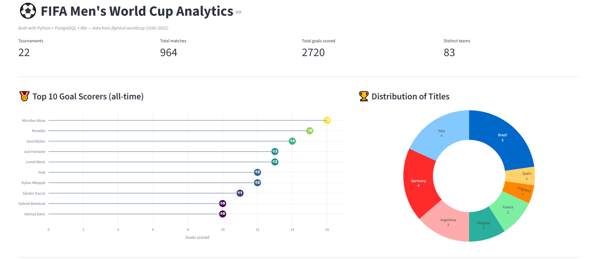
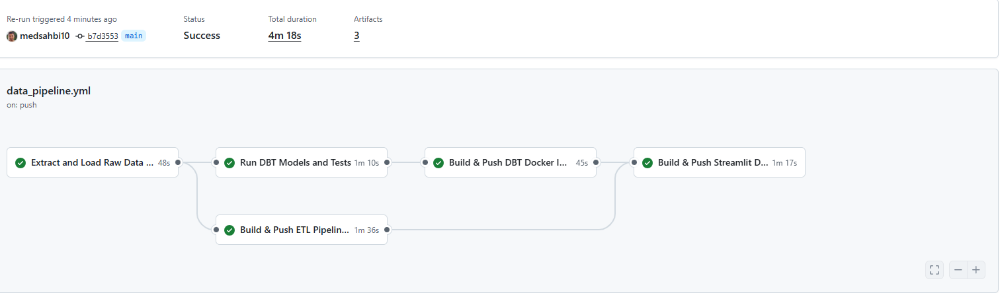
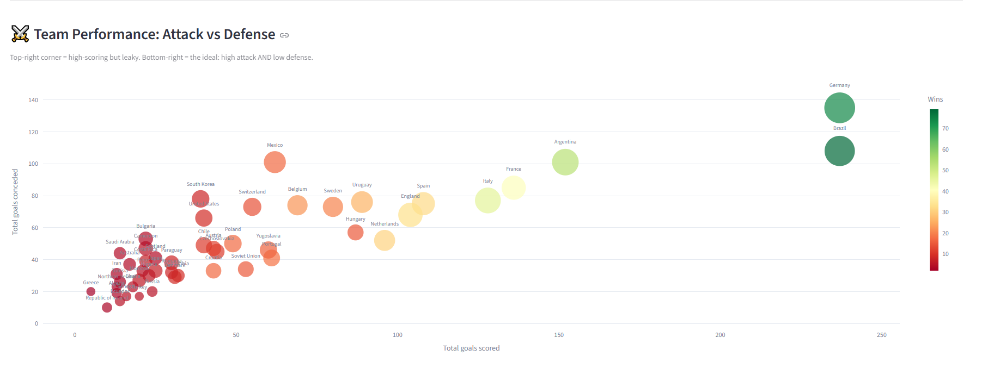
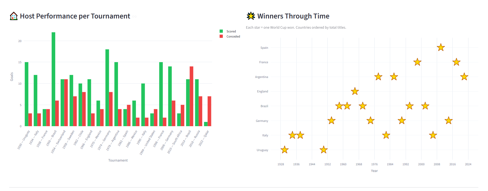

# ⚽ World Cup ETL Pipeline



This project implements an **end-to-end data analytics pipeline** for the *FIFA Men's World Cup* dataset using **PostgreSQL**, **dbt**, **Python**, and **Streamlit**, following the **Medallion Architecture (Bronze → Silver → Gold)** pattern.

It answers real business questions: *Who are the all-time top goal scorers? Which countries dominate? Do host nations perform better at home?*

> Built entirely **without Docker** — every component runs as a regular user-space process. Reproducible on a machine with no admin rights.

## 📚 Table of Contents
1. [🗂️ Project Overview](#️-project-overview)
2. [🏗️ Data Flow Architecture](#1-️-data-flow-architecture)
3. [🐍 Python ETL Setup](#2--python-etl-setup)
4. [🐘 PostgreSQL Setup](#3--postgresql-setup)
5. [🧠 DBT Setup](#4--dbt-setup)
6. [📊 Streamlit Setup](#5--streamlit-setup)
7. [🐳 Orchestration: Dockerized Architecture](#6--orchestration-dockerized-architecture)
8. [🚀 Deployment: GitHub Actions CI/CD](#7--deployment-github-actions-cicd)
9. [🧮 Models](#8--models)
10. [📈 Sample Insights](#9--sample-insights)
11. [🛠️ Usage](#10-️-usage)
12. [🗺️ Roadmap](#11-️-roadmap)
13. [📝 Design Decisions](#12--design-decisions)

## 🗂️ Project Overview

### 🎯 Objective

To design and build a fully open-source, reproducible analytics pipeline that:
- **Extracts** World Cup CSVs from a public dataset
- **Loads** them into PostgreSQL with Python
- **Transforms** them with dbt across staging and mart layers
- **Visualizes** the results in an interactive Streamlit dashboard

**Tools Used:**
- 🐍 **Python** — CSV ingestion (pandas + SQLAlchemy + python-dotenv)
- 🐘 **PostgreSQL 14** — local data warehouse (no Docker, EnterpriseDB portable binaries)
- 🧠 **dbt-postgres** — transformations and modeling
- 📊 **Streamlit + Plotly** — dashboard and visualization
- 📦 **Source data** — [jfjelstul/worldcup](https://github.com/jfjelstul/worldcup), an academic dataset of World Cup history (1930–2022)

## 1. 🏗️ Data Flow Architecture

```
            jfjelstul/worldcup CSVs (4 of 27 used: tournaments, matches, players, goals)
                          │
                          │  Python ETL (etl/load.py)  —  pandas + SQLAlchemy
                          ▼
            ┌──────────────────────────────────────────┐
            │  PostgreSQL: wc_raw schema                │  ← Bronze (raw, as-is)
            └──────────────────────────────────────────┘
                          │
                          │  dbt staging models (Jinja + SQL)
                          ▼
            ┌──────────────────────────────────────────┐
            │  PostgreSQL: wc_silver schema             │  ← Silver (cleaned, men's WCs only)
            └──────────────────────────────────────────┘
                          │
                          │  dbt mart models (Jinja + SQL)
                          ▼
            ┌──────────────────────────────────────────┐
            │  PostgreSQL: wc_gold schema               │  ← Gold (analytics-ready)
            └──────────────────────────────────────────┘
                          │
                          │  pandas + Plotly
                          ▼
                  Streamlit dashboard
```

| Layer | Description | Tools / Tasks |
|-------|-------------|---------------|
| **Source** | Public CSV files of World Cup matches, players, goals, tournaments | jfjelstul/worldcup (raw files on GitHub) |
| **Bronze Layer (Raw)** | CSVs ingested into PostgreSQL without modification | Python loader script |
| **Silver Layer (Staging)** | Light cleanup — scope filters, renames, type casting, canonicalization | dbt models (`stg_*`) |
| **Gold Layer (Marts)** | Aggregated, denormalized, business-ready tables | dbt models (`mart_*`) |
| **End-User Layer** | Interactive dashboard with KPIs, charts, and tables | Streamlit + Plotly |

## 2. 🐍 Python ETL Setup

The Python ETL (`etl/load.py`) handles:
- Reading the 4 source CSVs from `datasets/raw/`
- Loading each one into a corresponding table in the `wc_raw` schema of PostgreSQL

**Run the ETL locally:**
```bash
python etl/load.py
```

**Environment variables** (in a `.env` file at the project root):
```bash
DATABASE_NAME=superstore
DATABASE_USER=dev_user
DATABASE_PASSWORD=dev123
DATABASE_HOST=localhost
DATABASE_PORT=5432
```

**Output:** four raw tables (`wc_raw.tournaments`, `wc_raw.matches`, `wc_raw.players`, `wc_raw.goals`) with a total of ~15,000 rows.

## 3. 🐘 PostgreSQL Setup

Postgres acts as the central warehouse. Instead of running it in Docker, this project uses the EnterpriseDB **portable binaries** distribution — a zip file that runs without an installer and without admin rights.

```bash
# Initialize a data directory (one-time)
initdb -D %LOCALAPPDATA%\Programs\PostgreSQL14\data -U postgres -A scram-sha-256

# Start the server
pg_ctl -D %LOCALAPPDATA%\Programs\PostgreSQL14\data -l logfile start

# Create the database and schema for raw data
createdb superstore
psql -U postgres -d superstore -c "CREATE SCHEMA IF NOT EXISTS wc_raw AUTHORIZATION dev_user;"
```

The other two schemas (`wc_silver`, `wc_gold`) are created automatically by dbt the first time you run the models.

## 4. 🧠 DBT Setup

dbt is used for data modeling, transformations, and documentation. The project structure follows dbt conventions:

```
dbt_project/
├── dbt_project.yml              # Project config: model paths, materializations
├── profiles.yml                 # Connection config (env_var driven)
├── macros/
│   ├── generate_schema_name.sql    # Use custom schema names as-is
│   └── canonicalize_team_name.sql  # West/East Germany → Germany
└── models/
    ├── staging/
    │   ├── _sources.yml         # Declares the 4 raw tables as dbt sources
    │   ├── stg_tournaments.sql
    │   └── stg_matches.sql
    └── marts/
        ├── mart_world_cup_winners.sql
        ├── mart_host_performance.sql
        ├── mart_team_performance.sql
        └── mart_top_scorers.sql
```

**⚙️ Setup Steps:**

1. Connection settings are picked up from your `.env` (via the `env_var()` Jinja function in `profiles.yml`).
2. Build all models:
   ```bash
   dbt run --project-dir dbt_project --profiles-dir dbt_project
   ```
3. Generate and serve documentation:
   ```bash
   dbt docs generate --project-dir dbt_project --profiles-dir dbt_project
   dbt docs serve --project-dir dbt_project --profiles-dir dbt_project
   ```

## 5. 📊 Streamlit Setup

The Streamlit app (`streamlit/app.py`) reads the 4 gold marts and renders them with **six different chart types** — each chosen to suit the data being shown.

**Run the dashboard:**
```bash
streamlit run streamlit/app.py
```

| Section | Chart type | Source mart |
|---------|------------|-------------|
| KPIs (tournaments, matches, goals, teams) | Metric tiles | All |
| Top 10 goal scorers | Lollipop chart | `mart_top_scorers` |
| Distribution of titles | Donut chart | `mart_world_cup_winners` |
| Attack vs Defense (per team) | Scatter plot, sized by matches | `mart_team_performance` |
| Host performance per WC | Grouped bar (scored vs conceded) | `mart_host_performance` |
| Winners through time | Star scatter on year × country grid | `mart_world_cup_winners` |
| Reference tables | Tabbed dataframes | All |

## 6. 🐳 Orchestration: Dockerized Architecture

All four components also run inside **Docker containers** for easy setup and portability. The `docker-compose.yml` orchestrates them:

```
docker/
├── etl/Dockerfile          # Python ETL container
├── dbt/Dockerfile          # dbt-postgres container
└── streamlit/Dockerfile    # Streamlit dashboard container
docker-compose.yml          # Postgres + ETL + dbt + Streamlit
```

### Services

- **`postgres_db`** — `postgres:14` image; runs `scripts/pg_init.sql` on first boot to create the `dev_user` role and the `wc_raw` schema.
- **`etl_app`** — Python 3.10 + project requirements. Waits for `postgres_db` to be healthy, then runs `python3 etl/load.py`.
- **`dbt`** — Python 3.10 + `dbt-core` + `dbt-postgres`. Waits for Postgres, then runs `dbt build`.
- **`streamlit_app`** — Python 3.10 + Streamlit + Plotly. Exposes the dashboard on `http://localhost:8501`.

### Run with Docker

```bash
# Build images and start all services (detached)
docker-compose up --build -d

# Stop all services and remove volumes (clean slate)
docker-compose down -v
```

The Streamlit dashboard becomes available at `http://localhost:8501` once dbt has finished building the marts.

## 7. 🚀 Deployment: GitHub Actions CI/CD

A GitHub Actions workflow at `.github/workflows/data_pipeline.yml` runs automatically on every push to `main` (and on manual trigger from the Actions tab).



### What it does

| Job | What it validates |
|-----|-------------------|
| `test-etl-pipeline` | Spins up a Postgres 14 service, runs `etl/load.py`, verifies it succeeds |
| `test-dbt-pipeline` | After the ETL passes, runs `dbt debug`, `dbt run`, `dbt test` against the same Postgres |
| `build-and-push-etl-docker` | Builds the ETL Docker image and pushes it to Docker Hub |
| `build-and-push-dbt-docker` | Builds the dbt Docker image and pushes it to Docker Hub |
| `build-and-push-streamlit-docker` | Builds the Streamlit Docker image and pushes it to Docker Hub |

### Required GitHub secrets

To make the workflow run, add the following under **Settings → Secrets and variables → Actions**:

| Secret | Description |
|--------|-------------|
| `DATABASE_USER` | Postgres username (e.g. `dev_user`) |
| `DATABASE_PASSWORD` | Postgres password |
| `DATABASE_NAME` | Postgres database name (e.g. `superstore`) |
| `DOCKERHUB_USERNAME` | Your Docker Hub username |
| `DOCKERHUB_TOKEN` | A Docker Hub Personal Access Token (create at hub.docker.com → Account Settings → Security) |

Once secrets are in place, every push to `main` triggers the full pipeline (test → build → publish). You'll see green ✅ or red ❌ next to each commit in the GitHub UI.

## 8. 🧮 Models

### Staging (cleanup layer — `wc_silver`)

| Model | Rows | What it does |
|-------|-----:|--------------|
| `stg_tournaments` | 22 | Filters tournaments to men's WCs; canonicalizes `host_country` and `winner` |
| `stg_matches` | 964 | Filters matches to men's WCs via JOIN; canonicalizes home/away team names |

### Marts (analytics layer — `wc_gold`)

| Model | Rows | Answers |
|-------|-----:|---------|
| `mart_world_cup_winners` | 22 | Who won each men's World Cup |
| `mart_host_performance` | 21 | How hosts performed at their home tournament |
| `mart_team_performance` | 83 | Per-team all-time stats: W/D/L, goals for/against, goal difference |
| `mart_top_scorers` | 20 | Top scorers in men's WC history (own goals excluded) |

### Macros

| Macro | Purpose |
|-------|---------|
| `generate_schema_name(custom_schema)` | Uses custom schema names verbatim (overrides default dbt prefixing) |
| `canonicalize_team_name(col)` | Maps West/East Germany → Germany; ready to extend (Soviet Union → Russia, etc.) |

## 9. 📈 Sample Insights

### 🥇 Top Scorers + 🏆 Title Distribution


- **Miroslav Klose** holds the all-time men's WC scoring record with **16 goals** (Germany).
- Ronaldo (Brazilian, 15) and Gerd Müller (14) follow closely.
- Brazil leads the title count with **5**; Italy and Germany each have **4**.
- 8 countries have ever won the World Cup.

### ⚔️ Team Performance: Attack vs Defense



- **Germany** and **Brazil** are in their own league for total goals scored (237 each).
- Brazil's goal difference (+129) edges out Germany's (+102) — Brazil is the strongest team by net goals.
- Argentina, France, and Italy form the second tier with similar goal differences (~+51).

### 🏠 Host Performance + 🌟 Winners Through Time



- Hosts won their home World Cup **5 out of 20 times** (25%).
- Host nations average **9.8 goals scored vs 5.4 conceded** — a real home advantage.
- The "Winners Through Time" star grid shows Brazil's dominance, Italy's golden years (1934–1938), and Argentina's recent revival (2022).

## 10. 🛠️ Usage

### Option A — Run everything with Docker (recommended)

```bash
git clone https://github.com/medsahbi10/world-cup-etl-pipeline.git
cd world-cup-etl-pipeline
copy .env.example .env             # then edit .env with your chosen credentials

docker-compose up --build -d       # builds + starts postgres, etl, dbt, streamlit

# When you're done:
docker-compose down -v
```

Dashboard: `http://localhost:8501`.

### Option B — Run locally without Docker

```bash
# 1. Clone
git clone https://github.com/medsahbi10/world-cup-etl-pipeline.git
cd world-cup-etl-pipeline

# 2. Python venv + dependencies
python -m venv .venv
.venv\Scripts\activate             # Windows  (use 'source .venv/bin/activate' on macOS/Linux)
pip install -r requirements.txt

# 3. Create .env with your Postgres credentials
copy .env.example .env             # then edit .env with your real password

# 4. Ensure the wc_raw schema exists (one-time)
psql -U postgres -c "CREATE SCHEMA IF NOT EXISTS wc_raw;"

# 5. Load CSVs into Postgres
python etl/load.py

# 6. Build all dbt models
dbt run --project-dir dbt_project --profiles-dir dbt_project

# 7. Launch the dashboard
streamlit run streamlit/app.py
```

The dashboard opens at `http://localhost:8501`.

## 11. 🗺️ Roadmap

- [ ] Build `stg_goals` and `stg_players` to canonicalize the goals table (currently `mart_top_scorers` still shows "West Germany" in the `country` column)
- [ ] Clean up `given_name = 'not applicable'` for single-name Brazilian players in staging
- [ ] Extend canonicalization to Soviet Union → Russia, Czechoslovakia → Czech Republic, Yugoslavia → Serbia
- [ ] Handle co-hosted tournaments (e.g. Korea/Japan 2002) in `mart_host_performance`
- [ ] Add dbt tests (`not_null`, `unique`, `relationships`) on key columns
- [x] ~~CI/CD with GitHub Actions~~ (done — see `.github/workflows/data_pipeline.yml`)
- [x] ~~Docker / docker-compose setup~~ (done — see `docker/` and `docker-compose.yml`)
- [ ] Optional women's World Cup mode (toggle the men's-only filter)

## 12. 📝 Design Decisions

- **Why filter to men's only?** Keeps scope tight for v1. The women's WC dataset is the same shape, so adding it later is a one-line filter change.
- **Why combine West Germany and Germany?** For "best team ever" analytics, treating the German football team as one continuous entity is more useful than splitting by political era. The original names are preserved as `*_original` columns for traceability.
- **Why no Docker?** This project was built on a machine without Docker access (locked-down corporate laptop). The full Python + Postgres + dbt + Streamlit stack works fine as user-space processes — no admin rights required.
- **Why dbt over plain SQL scripts?** dbt's dependency graph (`{{ ref() }}`) automates execution order, materialization choices (view vs table), and lineage documentation — all features that would otherwise require manual orchestration code.
- **Why a `canonicalize_team_name` macro rather than inline CASE?** DRY (Don't Repeat Yourself). The same logic now applies to `stg_matches` and `stg_tournaments` from a single source of truth. Adding more historical name mappings is a one-line change.

## 📚 Summary

This project demonstrates:
- ✅ **End-to-end data pipeline** — Python ETL → Postgres → dbt → Streamlit
- ✅ **Medallion architecture** with clean separation of staging vs marts concerns
- ✅ **Reusable transformations** via dbt macros (DRY)
- ✅ **Real data-quality decisions** — historical team name canonicalization, women's WC scope filter, own-goal exclusion
- ✅ **Diverse data visualization** — 6 chart types tailored to the data they show
- ✅ **Reproducible local development without Docker**
